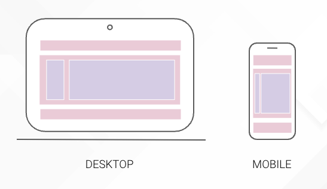

Una vez entendido el concepto de web responsive, vamos a realizar un pequeño ejercicio que nos va a permitir poner en práctica lo que hemos comentado.

En este ejercicio trabajaremos con unidades relativas al tamaño de la pantalla, los porcentajes, que nos van a permitir adaptar una estructura básica de web.



 

```html
<header><header>
<section>
	<main></main>
	<aside></aside>
</section>
<footer></footer>
```

  

```css
header, section, main, aside, footer {
	height: 300px;
  border: 2px solid black;
}

header, section, footer {
  background-color: pink;
}

main, aside {
  display: inline-block;
}

main {
  background-color: blue;
  width: 20%;
}

aside {
  background-color: red;
  width: 80%;
}
```

 

Jugar con los porcentajes implica riesgos, y tenemos que estar muy pendientes de la forma en la que trabajamos, así como tener ciertos conceptos claros. En este ejemplo la suma de los contenedores llega hasta el 100% del contenedor padre, sin embargo, sumando los bordes de estos contenedores hijos, ya estaríamos sobrepasando este 100%, al igual que si usásemos margin y paddings… La solución ante esto será el uso de flex o grid ( hay otras alternativas pero estas nos parecen las mejores.

```css
section {
 display: flex;
}
```

A la hora de gestionar este responsive muchas veces usamos también el **max-width** y **min-width** que nos da una seguridad extra (ya verás como a lo largo de los proyectos lo usas mucho)
