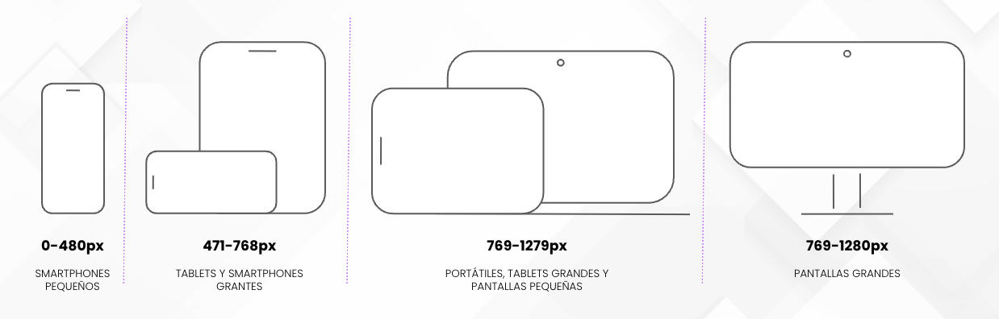

Las medias queries son unas reglas de CSS que nos van a permitir aplicar determinados estilos a tamaños de pantalla específicos, lo que nos va a ser de gran ayuda a la hora de trabar con los diseños que tengamos de la web.

Para trabajar con ellas tenemos que introducir la siguiente línea en el head de nuestro HTML.

```html
<meta name="viewport" content="width=device-width, initial-scale=1.0">
```

 

¿Qué indica esta etiqueta? El viewport hace referencia a la región visible del navegador e indica que el ancho de la vista será como máximo el ancho del dispositivo. 

Si queréis investigar un poco más las posibilidades del viewport os dejamos la documentación, de momento con esto es suficiente para seguir avanzando con el responsive.

> https://developer.mozilla.org/en-US/docs/Web/HTML/Viewport_meta_tag

El siguiente paso sería conocer la sintaxis:

```css
@media screen and (CONDICIÓN) {
  /* estilos */
}

@media screen and (CONDICIÓN) {
  /* estilos */
}
```

 

### EJEMPLO CON MEDIA QUERIES

Como ejemplo vamos a cambiar el color de fondo de un título en función del tamaño de pantalla.

```css
@media screen and (max-width: 479px) {
  h1 {
    background: green;
  }
}

@media screen and (min-width: 480px) and (max-width: 767px) {
  h1 {
    background: yellow;
  }
}

@media screen and (min-width: 768px) and (max-width: 1279px) {
  h1 {
    background: red;
  }
}

@media screen and (min-width: 1280px) {
  h1 {
    background: blue;
  }
}
```

> https://developer.mozilla.org/es/docs/Web/CSS/Media_Queries/Using_media_queries

## **TAMAÑOS DE PANTALLA**

Al final, a la hora de desarrollar un proyecto, los ajustes de tamaño en las media queries dependerá de los diseños y requisitos del cliente. Por norma general se siguen un aproximado de estos tamaños para poder trabajar con ellos:


