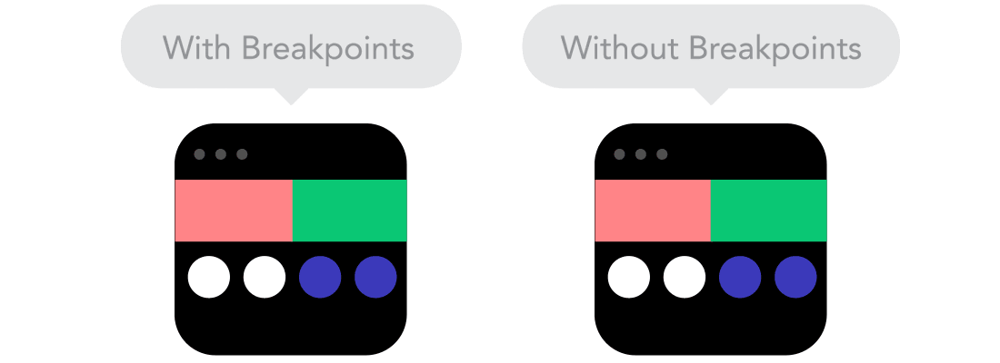

Este video es un poco más teórico que el resto, el objetivo principal es entender que es el diseño responsive, por qué surge, su utilidad y demás.

Con la aparición del smartphone y la lluvia de dispositivos siguientes (tablet, smartwatch y demás) surge la necesidad de que el contenido de las páginas web se moldee y adapte a todos los tamaños de pantalla desde donde se pueda consumir ese contenido, es lo que conocemos como diseño responsive.

Gracias a CSS, podremos trabajar y adaptar nuestros estilos a los diferentes tamaños de pantalla aplicando ciertas reglas, es muy importante tener en cuento esto a la hora de maquetar ya que una mala adaptación implicará que no se visualizará correctamente el contenido.

Vamos a ir conociendo algunos conceptos básicos sobre el responsive:

### **MOBILE FIRST**

A la hora de iniciar un proyecto es necesario establecer una estrategia de diseño enfocada en:

- **Mobile first:**  El objetivo es enfocarse primero en el diseño móvil y luego expandir hacia los otros tamaños de pantalla.
- **Desktop first:** El objetivo es enfocarse primero en el diseño desktop y luego expandir hacia los otros tamaños de pantalla.

Son dos vertientes a la hora de maquetar, aunque en los últimos años y viendo la importancia de los dispositivos móviles no hay duda en que deberíamos orientarnos siempre al mobile first.

### DIFERENCIA ENTRE DISEÑO RESPONSIVE Y ADAPTATIVO

Hay una gran diferencia entre diseño responsive y adaptativo:

- El diseño responsive es aquel que se adapta en todo momento al tamaño del dispositivo
- El diseño adaptativo está enfocado en adaptarse a determinados tipos de pantalla lo que implica que puede haber circunstancias en que no responda como se espera a un tamaño de pantalla específico.

### UNIDADES

Trabajar con unidades relativas nos ayudará a adaptar mejor nuestros diseños. No significa que utilizar unidades fijas sea malo, hay determinadas ocasiones en las que son necesarias.

### BREAKPOINTS

Los puntos de ruptura con los que trabajaremos más adelante nos permiten mostrar la información de manera diferente en distintos tamaños de pantallas. Por ejemplo una distribución de 4 columnas en escritorio , 2 en tablet y 1 en móvil.

### **TAMAÑOS**

Utilizar determinadas propiedades del CSS como el max-width y min width no permite adaptarnos a los diseños buscados.

Otro concepto, que a la misma vez es una característica muy atractiva en nuestros diseños responsive es la de mantener el flujo de los elementos cuando cambian de tamaño y evitar que estos se solapen unos con otros.

### FLOW

En proyectos nuevos no es el caso pero a la hora de trabajar en proyectos antiguos donde hay que aplicar responsive suele ser costoso, en todo momento tenemos que tener en cuenta que el contenido ocupa más a lo alto a la hora de hacer responsive, por lo que tenemos que respetar ese flow.

Esto último va muy de la mano del sistema habitual de recolocación de elementos que se suele seguir en los diseños **Responsive Design**. Como se puede ver en la siguiente imagen, en un diseño responsive se utilizan ciertos «puntos de control».

### IMÁGENES

Hay que tener en cuenta que determinados elementos no son escalables hasta el infinito, por lo que siempre que podamos habría que usar formatos vectoriales, como SVG.

