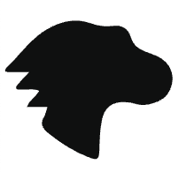

## SVGs

Como hemos comentado al inicio de la sesión, los SVG (Scalable Vector Graphics) es un formato de imagen para gráficos vectorizados que permite el escalamiento sin perder definición.



La estructura de un svg es muy similar a un documento HTML:

 

```html
<?xml version="1.0" standalone="no"?>
<svg width="200" height="250" version="1.1" xmlns="http://www.w3.org/2000/svg">

  <rect x="10" y="10" width="30" height="30" stroke="black" fill="transparent" stroke-width="5"/>
  <rect x="60" y="10" rx="10" ry="10" width="30" height="30" stroke="black" fill="transparent" stroke-width="5"/>

  <circle cx="25" cy="75" r="20" stroke="red" fill="transparent" stroke-width="5"/>
  <ellipse cx="75" cy="75" rx="20" ry="5" stroke="red" fill="transparent" stroke-width="5"/>

  <line x1="10" x2="50" y1="110" y2="150" stroke="orange" stroke-width="5"/>
  <polyline points="60 110 65 120 70 115 75 130 80 125 85 140 90 135 95 150 100 145"
      stroke="orange" fill="transparent" stroke-width="5"/>

  <polygon points="50 160 55 180 70 180 60 190 65 205 50 195 35 205 40 190 30 180 45 180"
      stroke="green" fill="transparent" stroke-width="5"/>

  <path d="M20,230 Q40,205 50,230 T90,230" fill="none" stroke="blue" stroke-width="5"/>
</svg>
```

 

### USO SVG

Tenemos diferentes formas de usar SVGs en nuestros proyectos web:

- Mediante la etiqueta **IMG**

```html

```

 

- Directamente en HTML con la etiqueta **SVG**

```html
<svg xmlns="[http://www.w3.org/2000/svg](http://www.w3.org/2000/svg)" viewBox="0 0 500 414.46" width="200">
<title>dino</title>
<path d="M133.69 256.8h-58c7.61-20.46 25.64-28.78 35-45.75-17.41-7.91-35.29-2-52.37-3.91-4.76-.52-11.55 1.95-12.86-4.74-.6-3.09 2.89-7.59 5.51-10.6 8.34-9.57 17.15-18.74 30.93-33.63-22.73 0-39.29-.09-55.84 0-10.74.08-16.4-4.14-7.2-13C57.05 108.24 87 62.32 134.46 35.32c39-22.14 79.91-31.45 123.76-15.18a123.51 123.51 0 0 0 60.72 6.71c23.58-3.11 43.19 6.3 49.79 31 5.75 21.58 19.44 33.48 39.24 40.65 11.3 4.1 22.39 8.81 33.53 13.35 45.5 18.6 59.5 69.61 30.21 110.25-13.63 18.9-59.71 34.51-83.43 27.24-13.33-4.08-26.55-7-40.52-6.78-33.2.47-52.75 16.75-59.78 49-6.67 30.56-6.49 61.72-7.83 92.6-1 22.2-7.58 23.35-26.54 16.32-43.44-16.1-81.35-40.38-117-69.37-16.91-13.74-24.93-27-11.84-47.67 4.32-6.88 5.42-15.82 8.92-26.64z" fill="#0d0e0e"/>
</svg>
```

- En CSS

```css
background-image: url(./dino.svg);
```

### FORMAS BÁSICAS

Rectángulos:

```html
<rect x="10" y="10" width="30" height="30"/>
```

Círculos:

```html
<circle cx="25" cy="75" r="20"/>
```

Elipses:

```html
<ellipse cx="75" cy="75" rx="20" ry="5"/>
```

Poli-líneas:

```html
<polyline points="60 110, 65 120, 70 115"/>
```

Polígonos:

```html
<polygon points="50 160, 55 180, 70 180"/>
```

Líneas:

```html
<line x1="10" x2="50" y1="110" y2="150"/>
```

 

Paths:

```html
<path d="M20,230 Q40,205 50,230 T90,230" fill="none" stroke="blue" stroke-width="5"/>
```

 

### ESTILADO

Al tratarse de elementos HTML podemos aplicar diferentes estilos

```css
svg {
    fill: #ffffff;
}
```