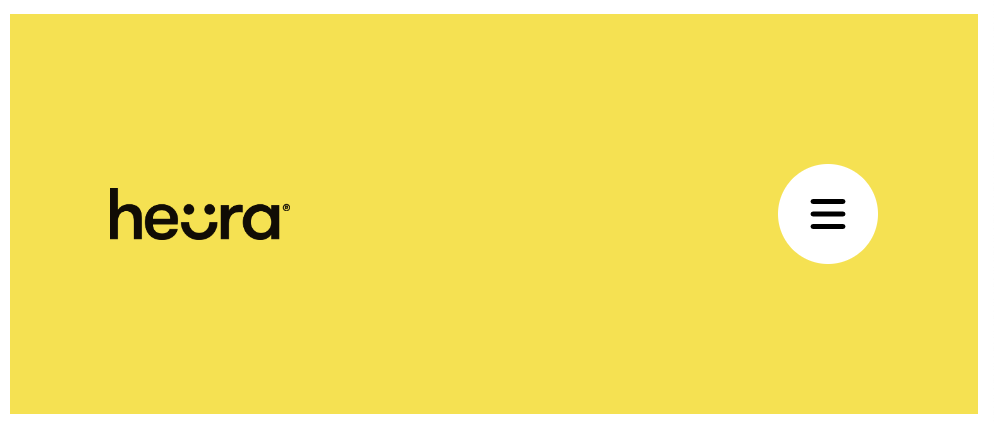
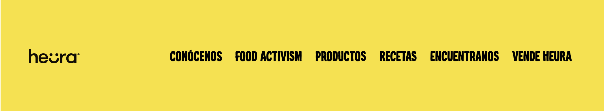

[assets.zip](recursos/assets.zip)

---

El equipo de Heura se ha enterado de que ya sabemos hacer webs responsive y nos ha pedido que les echemos una mano con el header de su web:

- Diseño para tamaños de pantalla de menos de 1024px

- Diseño para tamaños de pantalla de más de 1024px

Debemos:

- Utilizar media queries para adaptar el menú a los tamaños de pantalla.
- Integrar dentro de nuestro proyecto fontawesome para utilizar el icono de menú.
- Usar la tipografía de Heura suministrada.
- Tanto para el hover de cada uno de los elementos del menú desktop como para la hamburguesa del menú movil, tendremos que añadir una transición.
- Color del fondo: #f9e021.
